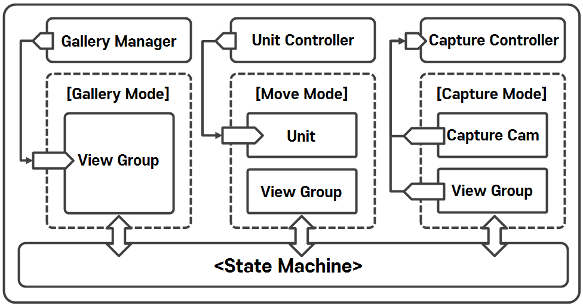

# CaptureSystem

#### ⦁ [CaptureSystem]은 게임 화면을 찍을 수 있는 기본 어플리케이션의 [카메라] 기능을 하는 시스템입니다.

#### ⦁ [CaptureSystem]을 통해서 찍은 사진들을 Texture로 저장 및 보관하여, [갤러리]를 통하여 찍은 사진을 확인할 수 있습니다. 

#### ⦁ Version 1.0 (2023.09.07)

### 1. 데모 이미지

    

### 2. 조건

- [Capture System]은 게임 내 화면을 스크린샷하고 저장해야하며, 갤러리를 통해서 사진들을 확인할 수 있어야 할 것 

### 3. 메인 설계

    

- **데모**

  - 데모 프로젝트는 **'State Machine'을 이용하여 'Gallery Mode', 'Move Mode', 'Capture Mode'를 변경**해가며 진행
 
  - 프로젝트의 첫 시작으로 'Main'에서 각 모드에 대한 초기화하며, **첫 초기화 역할만 수행**
 
  - 모드 상태에서는 **각 모드의 정보들을 리플레쉬하는 역할만 수행**

- **Capture Controller 설계**

  - **[Capture System]** 은 전체 프로젝트의 **'Capture Mode'에서 화면을 스크린샷 하고 저장하는 기능을 담당**하고 있으며, 실질적으로 **[Capture Controller]가 스크린샷을 찍는 주체**
    
  - 스크린샷을 찍기 위해 **Capture를 담당하는 Camera가 따로 존재(CaptureCamera)** 하며, **실질적으로 Rendering은 하지 않도록 구성**
 
  - **[Capture Controller]는 'CaptureCamera'으로 특정 해상도의 Texuture을 찍고 Sprite 파일로 저장하는 역할**만 하도록 구성
 
- **Capture Group**

  - **[Capture Controller](https://github.com/MinjunISAAC/CaptureSystem/blob/main/CaptureSystem/Assets/Game/Scripts/Capture/CaptureController.cs)**

- **Unit Group**

  - Unit에서도 State Machine을 이용해서 움직임을 관리

  - **[Unit Controller](https://github.com/MinjunISAAC/CaptureSystem/blob/main/CaptureSystem/Assets/Game/Scripts/Unit/UnitController.cs)**

  - **[Unit](https://github.com/MinjunISAAC/CaptureSystem/blob/main/CaptureSystem/Assets/Game/Scripts/Unit/Unit.cs)**
    
- **Gallery Group**

  - **[Gallery Manager](https://github.com/MinjunISAAC/CaptureSystem/blob/main/CaptureSystem/Assets/Game/Scripts/Gallery/GalleryManager.cs)**
    
  - **[Photo Frame](https://github.com/MinjunISAAC/CaptureSystem/blob/main/CaptureSystem/Assets/Game/Scripts/Gallery/PhotoFrame.cs)** 

- **기타**

  - **[State Group](https://github.com/MinjunISAAC/CaptureSystem/tree/main/CaptureSystem/Assets/Game/Scripts/State)**
    
  - **[Camera Controller](https://github.com/MinjunISAAC/CaptureSystem/blob/main/CaptureSystem/Assets/Game/Scripts/Camera/CamController.cs)**
